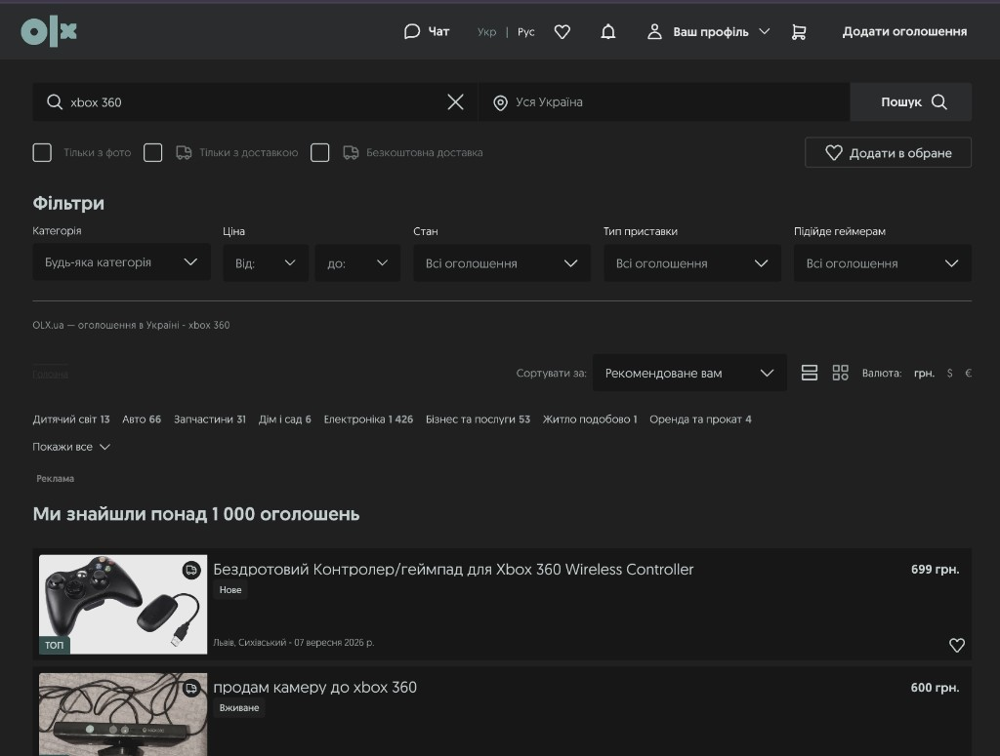

# OLX Dark Theme

A Chrome extension that applies a charcoal dark theme to [OLX.ua](https://www.olx.ua/).

## Install

1. Open `chrome://extensions`
2. Turn on **Developer mode**
3. Click **Load unpacked**
4. Select this folder
5. Open [olx.ua](https://www.olx.ua/)

Use the toolbar popup to pause or resume the theme.
